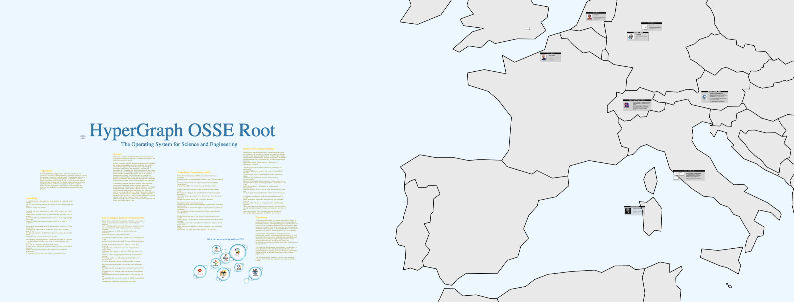
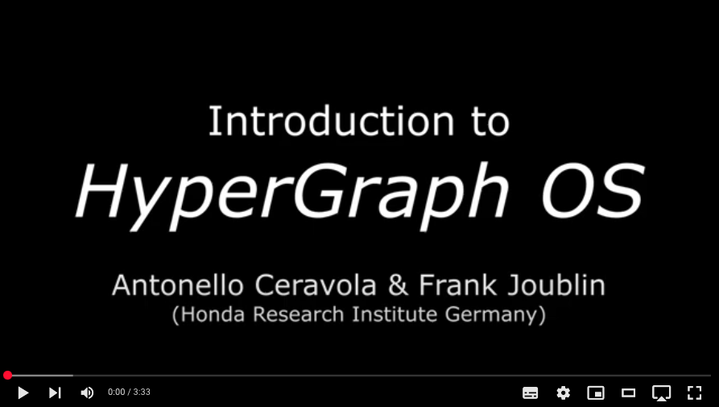
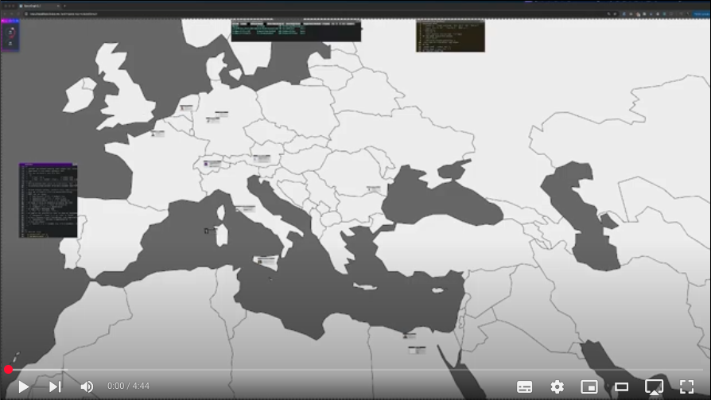
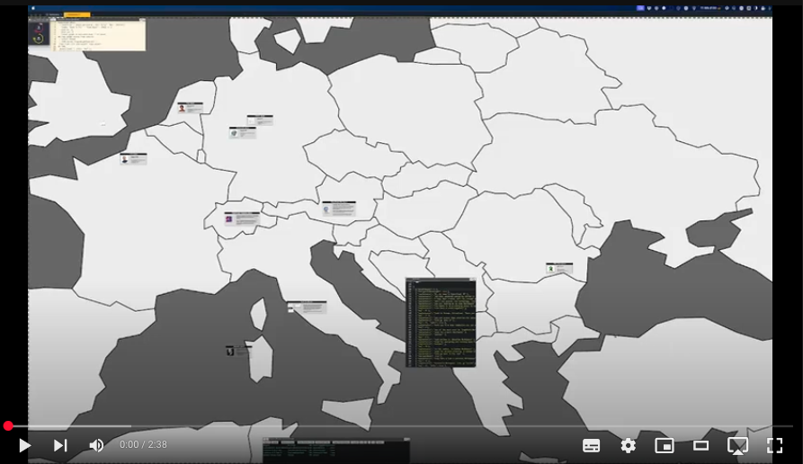
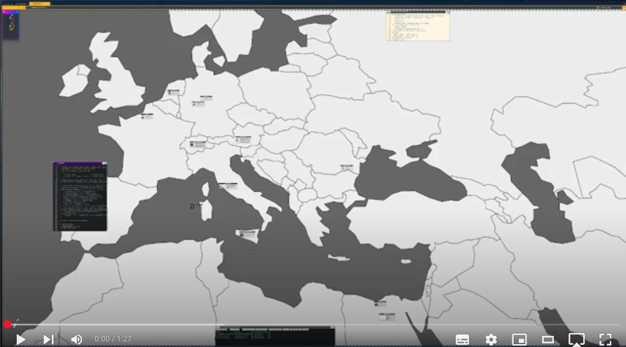
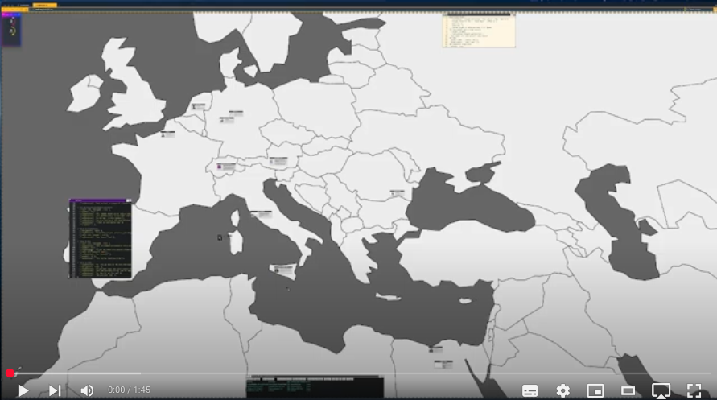

# HyperGraphOS
HyperGraphOS is an innovative Operating System (OS) designed for the scientific and engineering domains. It combines model-based engineering, graph modeling, data containers, and computational tools, offering users a dynamic workspace for creating and managing complex models represented as customizable graphs. 

Using a web-based architecture, HyperGraphOS can be started from a modern browser. It allows to organize knowledge, documents, and content into interconnected models. Through the influrce of Model Based System Engineering (MBSE), Domain-Specific Languages (DSLs) and GoJS (a powerful graphic library) HyperGraphOS provide a new experience in workspace navigation, code generation, AI integration, and information/process organization.

  

# Tutorial Videos
Here some introductory videos that illustrate HyperGraphOS showing example usage:

<h3>Introduction to HyperGraph OS<h3>

  

<h3>Interactive Tour<h3>

  

<h3>HyperGraphOS Templates<h3>

  

<h3>OmniSpace and WorkSpace Concepts in HyperGraphOS<h3>

  

<h3>DSL: Domain Specific Languages Tour<h3>

  

# HyperGraphOS Get Started
- clone the repository
- go in the following directories and download some dependencies necessary for the system. You will find a README.txt (check sub-directories too)
    - system/2.1/client/lib:
        - ace
        - explore-editor
        - gojs
        - KaTeX
        - winbox
        - yaml
- open a shell (Linux: Bash or Windows: Git-Bash)
- go to system dir: cd hypergraphos/system/2.1/
- run server: ./startServer.sh
- open chrome browser at: localhost:8080/indexHG.html?name:'NoName'
- now you should see the landing page of HyperGraphOS
- to use existing DSLs. Kindly follow the examples in hypergraphos/Documentation
- enjoy ♪♫

# Dependencies
HyperGraphOS graphical engine is based on GoJS by Northwoods Software (https://gojs.net).
This open source version uses GoJS Evaluation Licence (https://gojs.net/latest/evaluationlicense.html) which allow you to evaluate the Operating System for a limited period.
If you intend to use it or support development, you need to buy a GoJS license (https://nwoods.com/sales/index.html?p=GoJS). Consider that they offer also individual license targeting also startup and accademic licenses for non-commercial applications.
